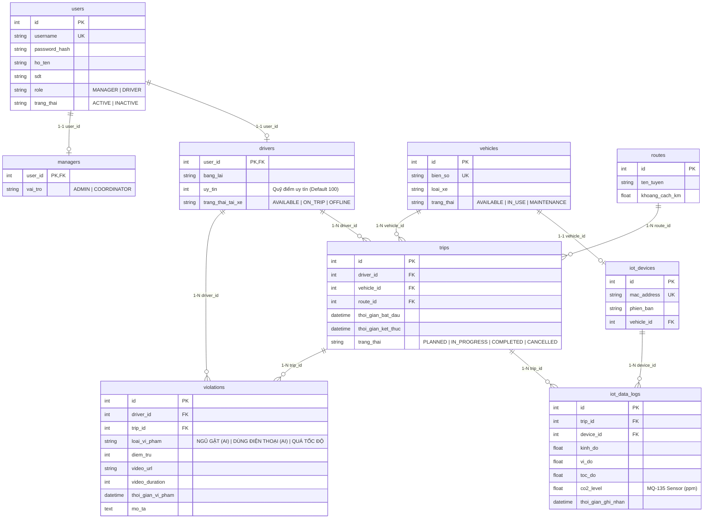

# 🚚 PBL4 FLEET - Hệ Thống Quản Lý Vận Tải, Giám Sát IoT & Cảnh Báo Sớm Buồn Ngủ (YOLO26 AI Edge)

<p align="center">
  <b>Đồ án PBL4: Hệ Thống Thông Tin & Truyền Thông (PBL4_HTTM)</b><br />
  <i>Trường Đại học Bách Khoa - Đại học Đà Nẵng (DUT)</i>
</p>

<p align="center">
  
  
  
  
  
  
  
  
</p>

---

## 🌟 Tổng Quan Hệ Thống

**PBL4 FLEET** là giải pháp toàn diện kết hợp giữa **Cảnh Báo Sớm Buồn Ngủ AI Edge (YOLO26 trên Raspberry Pi 4 + ESP32)**, **Định vị GPS & Cảm biến Khí Cabin $CO_2$ (MQ-135)** và **Hệ thống Web/Mobile Dashboard Thời Gian Thực**.

Hệ thống giúp các doanh nghiệp vận tải giám sát trạng thái xe trực tuyến, tự động phát hiện vi phạm / dấu hiệu mệt mỏi của tài xế, tự động trừ điểm uy tín và minh bạch hóa bằng chứng qua Video Evidence Stream.

---

## ✨ Các Tính Năng Cốt Lõi

### 📡 1. Real-Time Live Tracking
- Định vị vị trí GPS và tốc độ xe chạy trực tuyến trên bản đồ **Leaflet Maps** mượt mà mỗi 3-5s qua **WebSocket (Socket.io)**.
- Hiển thị popup chi tiết: tên tài xế, biển số xe, quỹ điểm uy tín và tốc độ vận hành.

### 👁️ 2. Cảnh Báo Sớm Buồn Ngủ & Mất Tập Trung (YOLO26 AI Edge)
- **Nhắm mắt (`eyes_closed` continuous $\ge 2\text{s}$)**: Phát hiện ngủ gật $\rightarrow$ Kích còi báo động gắt, bật Đèn Đỏ, tự động trừ **10 điểm uy tín** và gửi Email HTML khẩn cấp.
- **Dùng điện thoại (`phone`)**: Phát hiện mất tập trung $\rightarrow$ Bật âm thanh nhắc nhở & trừ **5 điểm uy tín**.
- **Ngáp dài (`yawn` continuous $\ge 3\text{s}$)**: Cảnh báo dấu hiệu mệt mỏi $\rightarrow$ Trừ **2 điểm uy tín** & bật quạt lấy gió ngoài.

### 💨 3. Giám Sát Nồng Độ $CO_2$ Cabin (Cảm biến MQ-135)
- Đo nồng độ khí $CO_2$ trong cabin xe. Khi $CO_2 > 1000\text{ ppm}$ (nguy cơ thiếu oxy gây buồn ngủ), ESP32 tự đóng Relay bật **Quạt thông gió cabin**.

### ⚡ 4. Auto Deduct Points (Trigger Trừ Điểm Tự Động & Email Alert)
- Tự động cập nhật quỹ điểm uy tín của tài xế trong bảng `DRIVERS.uy_tin` ngay khi có bản ghi vi phạm mới.
- Tự động gửi **Email HTML thông báo khẩn cấp** tới Gmail của tài xế & quản lý qua **Nodemailer**.

### 🛣️ 5. Route Playback (Tua Lại Vệt Đường Xe Chạy)
- Truy vấn chuỗi tọa độ trong bảng `IOT_DATA_LOGS` để vẽ vệt đường Polyline và tua lại hành trình xe chạy (1x, 2x, 5x, 10x) kèm các mốc vi phạm.

### 📹 6. Video Evidence Stream
- Trình phát video HD nhúng Cloud Storage (AWS S3 / Cloudflare R2 / Server) giúp quản lý minh bạch hóa bằng chứng vi phạm.

### 📱 7. Luồng Báo Cáo Trên Điện Thoại Tài Xế (React Native Mobile Ready)
- Tài xế lên xe khởi động máy $\rightarrow$ Mở App báo **"🚀 Xác Nhận Bắt Đầu Hành Trình"** (`IN_PROGRESS`).
- Khi xe cập bến $\rightarrow$ Mở App báo **"🏁 Xác Nhận Kết Thúc Chuyến Xe"** (`COMPLETED`).
- Đã sẵn sàng file tài liệu kết nối API [mobileConfig.js](file:///e:/2.%20Documents/1.%20DUT/2.%20Nam%203/PBL4_HTTM/frontend/src/services/mobileConfig.js) cho ứng dụng di động React Native.

---

## 🗄️ Kiến Trúc Cơ Sở Dữ Liệu (9 Bảng Prisma ORM)



---

## 🔌 Kiến Trúc Phần Cứng IoT & AI Edge

```
[ USB Camera ] ────> [ Raspberry Pi 4 ] ──(UART Serial)──> [ ESP32 DevKit ] ──(Wi-Fi/4G)──> [ Backend Server ]
                     (YOLO26 Nano Model)                   (MQ-135 / Loa)
```

- **Raspberry Pi 4**: Chạy mô hình **YOLO26 Nano** phát hiện nhắm mắt/ngáp/điện thoại từ USB Camera, gửi cờ vi phạm qua UART.
- **ESP32 DevKit**: Đọc cảm biến MQ-135, nhận cờ UART từ Pi 4 $\rightarrow$ Điều khiển Loa DFPlayer phát còi/âm thanh, bật Đèn Vàng/Đỏ, đóng Relay quạt gió và đóng gói JSON gửi về Backend Server.

---

## 🛠️ Công Nghệ Sử Dụng (Tech Stack)

| **Phân loại** | **Công nghệ sử dụng** |
| --- | --- |
| **Frontend Web** | React 19, Vite, Tailwind CSS, Leaflet Maps, Lucide Icons, Socket.io-client, Zustand |
| **Mobile App** | React Native API Specification (`mobileConfig.js`) |
| **Backend Server** | Node.js, Express.js, Socket.io, Prisma ORM, Nodemailer, Multer |
| **Database** | Supabase PostgreSQL / SQLite (`dev.db`) |
| **AI Edge & IoT** | Raspberry Pi 4, Ultralytics YOLO26, ESP32, MQ-135, DFPlayer Mini, Relay, LM2596 |

---

## 🔑 Tài Khoản Mẫu Kiểm Thử (Test Accounts)

- **Quyền QUẢN LÝ (MANAGER)**:
  - **Username**: `admin`
  - **Password**: `password123`
- **Quyền TÀI XẾ (DRIVER)**:
  - **Username**: `driver1`
  - **Password**: `password123`

---

## 🚀 Hướng Dẫn Khởi Chạy Hệ Thống

### 1. Khởi chạy Backend Server:
```bash
cd backend
npm install
npx prisma db push
node seed.js
npm run dev
```
Backend API sẽ chạy tại: `http://localhost:3000`

### 2. Khởi chạy Frontend Web App:
```bash
cd frontend
npm install
npm run dev
```
Giao diện Web sẽ chạy tại: `http://localhost:5173`

---

## 📄 Giấy Phép & Đồ Án
Đồ án được xây dựng phục vụ môn học **PBL4: Hệ Thống Thông Tin & Truyền Thông** tại Khoa CNTT - Trường Đại học Bách Khoa, Đại học Đà Nẵng (DUT).
